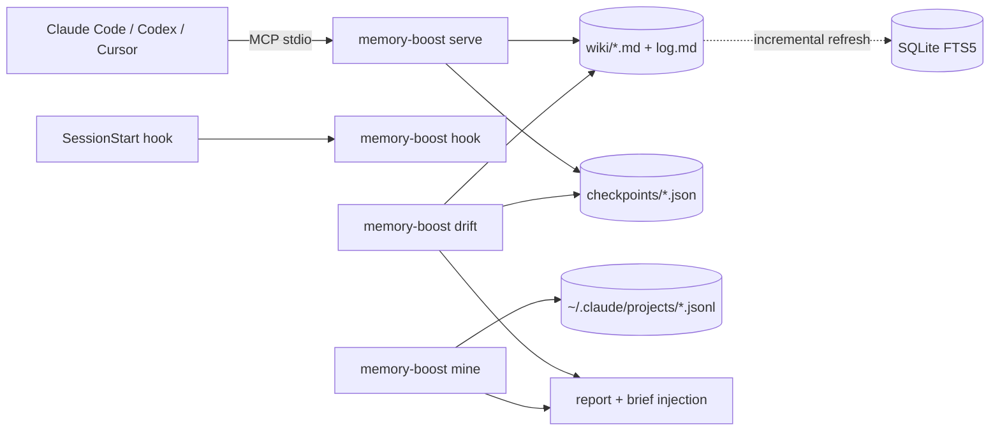

<!-- mcp-name: io.github.arnaugonzalez/memory-boost -->
<h1 align="center">memory-boost</h1>

<p align="center"><em>Memory for coding agents that reviews itself.</em></p>

<p align="center">
  <a href="https://github.com/arnaugonzalez/memory-boost/actions/workflows/ci.yml"></a>
  
  
</p>

<p align="center">
  <br>
  <sub>drift, mine and lessons on the bundled example data · everything runs locally</sub>
</p>

<p align="center">
  <a href="#try-it-in-30-seconds">Try it</a> ·
  <a href="#what-it-answers">What it answers</a> ·
  <a href="#connect-your-harness">Connect your agent</a> ·
  <a href="#how-it-works">How it works</a> ·
  <a href="#vs-alternatives">vs. alternatives</a>
</p>

**Your agents write everything down. Nobody reads it back.**

Every memory tool for coding agents helps them remember *more*. None of them mention that half of
what they remember expired in July. memory-boost keeps a plain-markdown memory your agents read
and write over MCP, and then does the unglamorous part: it audits that memory and your own
sessions, and tells you what drifted. Politely, with numbers.

Think of it as a code review for what your agents remember and a fitness tracker for how you work
with them. Mostly the fitness tracker: `mine` told me my most-failed command was `cd`. Sixty-nine
times.

## What it answers

| You wonder… | memory-boost answers |
|---|---|
| Which decisions quietly expired while we were busy shipping? | `drift`: *review_by 2026-07-08, 78 days ago* |
| Which "active" projects actually died months ago? | `drift`: *last session 161 days ago; still listed as live* |
| We fixed this exact bug in another repo. How? | `lessons`: the fix follows you to every project with the same stack |
| Why does my agent keep re-reading the same file? | `mine`: *one file, read 18 times* |
| Is my agent spawning 20 subagents behind my back? | `mine`: yes, and in which session |
| Where was I before `/compact` ate my context? | The session-start hook puts your checkpoint back |

## Try it in 30 seconds

No install needed; the wiki lands in `~/.local/share/memory-boost`:

```bash
uvx memory-boost init --example   # sample wiki with five kinds of rot + four synthetic transcripts
uvx memory-boost drift            # what in that memory is stale, orphaned or never written down
uvx memory-boost mine             # now on your real ~/.claude/projects: aggregates only
```

To keep it in Claude Code, install the plugin. It brings the MCP server, the session-start
brief and the skills in one step; it only needs [uv](https://docs.astral.sh/uv/) on your PATH.

```
/plugin marketplace add arnaugonzalez/memory-boost
/plugin install memory-boost@memory-boost
```

Other agents, or the CLI on its own: `uv tool install memory-boost` (or `pipx install memory-boost`).

## On a real machine

Five weeks of the author's own daily use: 29 decisions, 24 projects, 657 Claude Code transcripts.
Output as produced; only project and file names are replaced.

```
$ memory-boost drift
# Drift report — 2026-09-24
29 decisions · 24 projects · 204 log entries · 33 open checkpoints · **20 findings**

## decision-expired (9)
- deploy-via-bastion — review_by 2026-07-08 (78 days ago); revisit or mark historic
- bot-guardrails — review_by 2026-07-08 (78 days ago); revisit or mark historic
  …
## project-no-decisions (2)
- thesis-solver — 20 sessions logged, 0 decisions tagged 'thesis-solver': the learning lives only in transcripts
## project-silent (5)
- mood-api — last session 2026-04-16 (161 days ago); still listed as live
  …

$ memory-boost mine
# Session digest — 2026-09-24
sessions      80 with ≥20 turns
tools         Bash 5956 · Edit 860 · Read 692 · Write 493 · Agent 203 · ToolSearch 138
bash          5956 calls, 159 failed (2.7%); most failed: cd (69), sleep (12), ssh (9), pkill (8), ls (7)
bash/edit     4.4x; extreme: crm-wt-f11 107.5x, sandbox 70.0x, sandbox 54.0x
reads         692 calls, 131 re-reads of a file already read (19%); top: …/apply_email.py ×18
discipline    62 long sessions (≥60 turns): 47 never checkpointed, 29 never saved
subagents     203 spawned in 44 sessions; max in one session: 20
```

Every line is a habit to change, a decision to revisit, or a rule worth writing down. None of
it needed a new tool: the data was already on disk. It needed a reader.

## What it is

1. **A wiki you own.** `projects/*.md`, `decisions/*.md`, `concepts/*.md`, `log.md`. Plain
   markdown; edit by hand, keep it in git. SQLite FTS5 index as a disposable cache. Eight MCP
   tools for any harness: `memory_brief`, `memory_recall`, `memory_page`, `memory_save`,
   `memory_checkpoint`, `memory_resume`, `memory_drift`, `memory_lesson`.
2. **Freshness as data.** Decisions carry `status:` and `review_by:`. Search results are tagged
   `current / unclassified / review / historic / superseded`, current first.
3. **Session checkpoints** that survive `/compact`, with one line per *other* active session on
   the same project so parallel agents don't collide.
4. **`drift`** reads the wiki and reports what expired, what went silent, what was never written
   down and what was left half-done. The current project's top findings go into every session brief.
5. **`mine`** reads your local Claude Code transcripts and reports tool usage, failed commands,
   re-reads, subagent fan-out and checkpoint discipline. Aggregates only: no prompt, command or
   file content is stored or printed, so the digest is safe to paste anywhere.
6. **`lessons`**: `concepts/` pages with `applies_when: [tags]`. A project page that lists
   matching `tags:` gets those lessons in its brief, so what worked in one repo reaches the next.
   The `/retro` skill writes them at session end.

## Connect your harness

MCP server (all harnesses): command `memory-boost`, args `["serve"]`.

| Harness | MCP registration | Context at session start |
|---|---|---|
| Claude Code (plugin) | `/plugin install memory-boost@memory-boost` | Included: hook, MCP server, skills |
| Claude Code (manual) | `claude mcp add memory -s user -- memory-boost serve` | Hook below (startup, resume, compact); `mine` reads its transcripts |
| Codex CLI | `codex mcp add memory -- memory-boost serve` | `AGENTS.md`: "call `memory_brief` first" |
| Cursor / VS Code / Gemini CLI | stdio entry in their `mcp.json` / `settings.json` | Same line in rules (hook adapters: roadmap) |

Manual Claude Code hook (`~/.claude/settings.json`), not needed with the plugin:

```json
{ "hooks": { "SessionStart": [ { "hooks": [ { "type": "command", "command": "memory-boost hook session-start" } ] } ] } }
```

On `startup`/`resume` it injects ~1k tokens: catalog, the project's context and last sessions,
its drift, lessons from other projects, your open checkpoint. On `compact` only this session's
checkpoint. It never blocks session start: on any error it prints nothing.

Skills: `/memory-boost` (router: when to run what), `/save-session`, `/restore-session`,
`/retro`. The plugin installs them as `/memory-boost:retro` and so on; without it, copy
`skills/*` into `~/.claude/skills/`. The first session after installing the plugin takes a few
extra seconds while uv fetches the package; later sessions start in about 0.2 s.

CLI contract for agents: data on stdout, errors on stderr with a `fix:` line, `--json` on every
reading command (with a `version` field), exit 0 = trust stdout, 1 = not found, 2 = bad input.
Reports end with a `next:` line naming the exact command to run.

## How it works



The project is resolved from the working directory name (`~/work/acme-api` → `projects/acme-api.md`);
map other names in `aliases.json`. Under 1,600 lines of Python, one dependency (`mcp`), no
embeddings, no daemon.

## Configuration

| Variable | Default | Purpose |
|---|---|---|
| `MEMORY_BOOST_HOME` | `$XDG_DATA_HOME/memory-boost` | Wiki, events, checkpoints, `aliases.json` |
| `MEMORY_BOOST_WIKI` | `$MEMORY_BOOST_HOME/wiki` | Point at an existing wiki (e.g. a git repo) |
| `MEMORY_BOOST_INDEX` | `$XDG_CACHE_HOME/memory-boost/index-<hash>.db` | Search index |
| `MEMORY_BOOST_CHECKPOINTS` | `$MEMORY_BOOST_HOME/checkpoints` | Checkpoint directory |
| `MEMORY_BOOST_TRANSCRIPTS` | `~/.claude/projects` | Where `mine` looks (several dirs: `a:b`) |
| `MEMORY_BOOST_TODAY` | today (UTC) | Pin the date for reproducible reports |

## vs. alternatives

| | memory-boost | [basic-memory](https://github.com/basicmachines-co/basic-memory) | [claude-mem](https://github.com/thedotmack/claude-mem) | [agent-retro](https://github.com/giannimassi/agent-retro) |
|---|---|---|---|---|
| Store | Markdown wiki you edit | Markdown | Captured observations | None (prompt skill) |
| Search | FTS5 | FTS + vectors | FTS + vectors | — |
| Freshness / review dates | Yes | No | No | — |
| Drift report over memory | Yes | No | No | No |
| Session analytics | Yes (aggregates, local) | No | No | LLM reads the conversation |
| Parallel-session awareness | Yes | No | No | — |
| License | MIT | AGPL-3.0 | Apache-2.0 | ? |

Want better search, more integrations and a community? Use basic-memory. Want everything
captured automatically? claude-mem. Use memory-boost if you want to *learn from* what your
agents already wrote down.

## Limits / non-goals

- Keyword search only; no embeddings.
- `mine` understands Claude Code transcripts today. Codex is on the roadmap.
- Reports are as good as the wiki: an empty wiki yields an empty `drift`.
- Single user, local files. Linux and macOS; Windows untested.
- The wiki is read by your agents as instructions. Only use a wiki you trust; see [SECURITY.md](SECURITY.md).

## License

MIT
